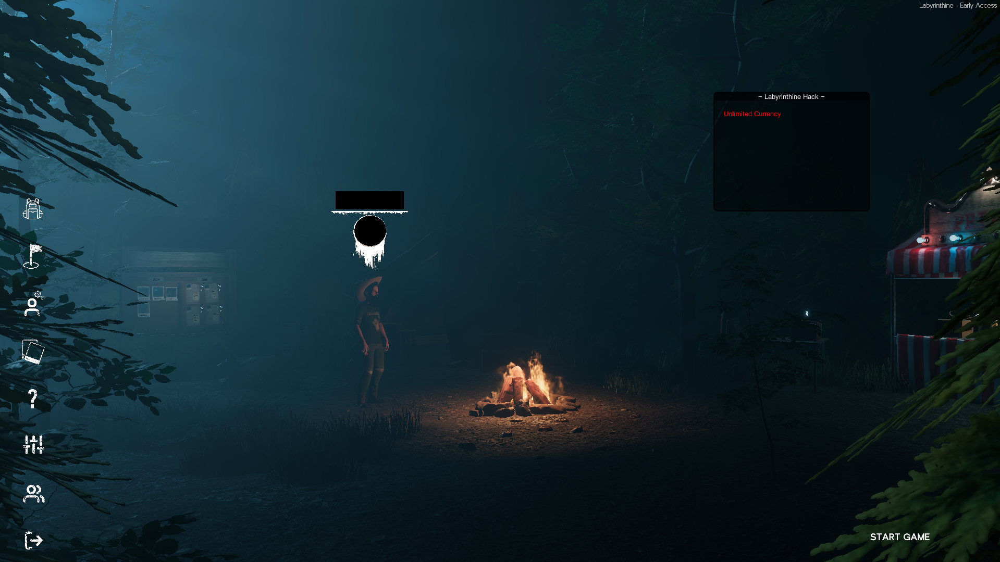
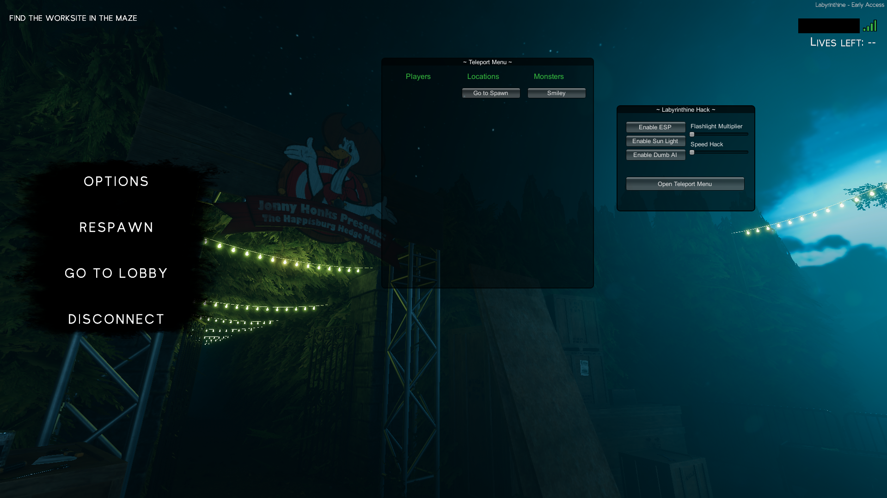

<h1 align="center">
  Labyrinthine Chets
</h1>

<h4 align="center">A set of cheats for the game [Labyrinthine](#Labyrinthine) .</h4>

  <a href="#key-features">Key Features</a> •
  <a href="#download-and-install">Download and Install</a> •
  <a href="#how-to-use">How To Use</a> •
  <a href="#credits">Credits</a> •
  <a href="#license">License</a>

## Key Features

* `Unlimited Currency` - Add `99999` to the currency
* `Speed Hack` - Change player movement speed with a slider
* `Flashlight Multiplier` - Adds more brightness to the flashlights
* `Sun Light` - Adds more light to the levels
* `ESP (Wall-hack)`
  - See monsters location and distance
  - See other player and distance
* `Dumb AI` - AI ignores players
* `Teleports`
  - Other players
  - To monsters
  - Some other locations like Spawn

## Download and Install

Download and install [MelonLoader](https://melonwiki.xyz/#/?id=manual-installation) manually.

* Use release version:
  - Download last [release](https://github.com/kanazaca/labyrinthine-hack/releases) version and put the file `Labyrinthine.dll` into the folder `Mods` in the game folder.

* Build the project
  1. Clone and build
     - `git clone https://github.com/kanazaca/labyrinthine-hack.git`
     - `cd labyrinthine-hack`
     - `dotnet restore`
     - `dotnet build`
  2. Copy file `Labyrinthine.dll` from project folder `bin\Debug` into the folder `Mods` in the game folder.

## How To Use

To show and hide the cheat menu press <kbd>F7</kbd>. The menu is only available in the `Lobby` and in `Levels`

Lobby:
 - Press `Unlimited Currency` to add 99999 to currency

In levels:
 - Slide the `Flashlight Multiplayer` to adjust light intensity
 - Slide the `Speed Hack` to adjust player velocity
 - Other button are self explanatory
 - Teleport buttons, press the button to teleport to the "thing"

## Credits

Awesome packages that we use:

- [MelonLoader](https://github.com/LavaGang/MelonLoader)
- [UnityExplorer](https://github.com/sinai-dev/UnityExplorer)

## License

MIT

---

> GitHub [@kanazaca](https://github.com/kanazaca) &nbsp;&middot;&nbsp;
> GitHub [@rafa-94](https://github.com/rafa-94)
